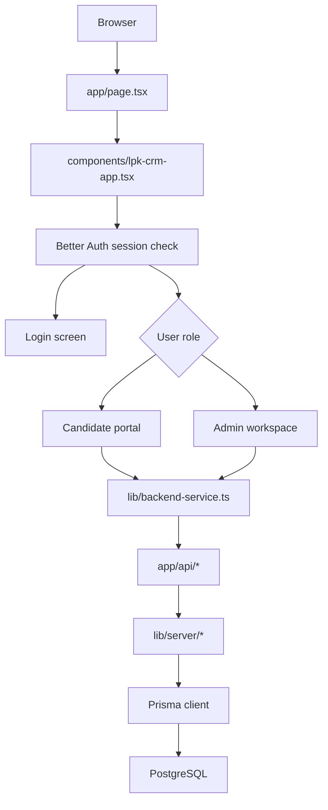
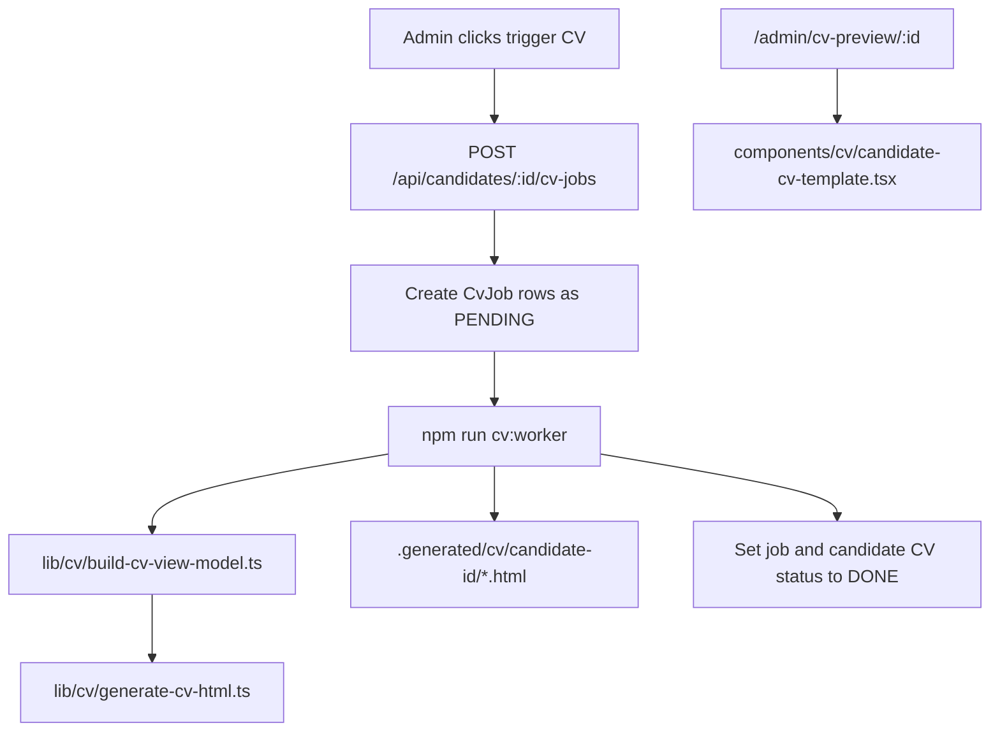

# Codebase Explanation - 10 May

Tag: `10 May`

This document explains the latest local codebase state for the LPK Candidate CRM. It is written as a practical map for developers who need to understand where the app starts, how data moves, and which files are safe to change.

## 1. Current Big Picture

This project is a full-stack Next.js application. The same repository contains:

- The browser UI, built with React, TypeScript, Tailwind CSS, and small shadcn-style UI components.
- Backend API routes under `app/api`.
- Better Auth login/session handling.
- Prisma database access.
- A PostgreSQL-backed candidate, user, file, test result, audit log, and CV job data model.
- A local CV generation path that builds CV view data, renders a React preview page, and can generate HTML through a worker script.

The main app no longer depends on mock data for the verified flow. The browser calls `lib/backend-service.ts`, which calls real API routes, which use Prisma to read and write PostgreSQL.

## 2. Main Runtime Flow

The first rendered page is `app/page.tsx`. It only renders `LpkCrmApp`. `components/lpk-crm-app.tsx` owns session loading, login/logout, role detection, and initial data refresh.

If the user is a candidate, the app shows `CandidatePortalRebuilt`. If the user is an admin or superadmin, it shows `AdminWorkspace`.

## 3. Important Folders

| Path | Purpose |
|---|---|
| `app/` | Next.js App Router pages and API routes. |
| `app/api/` | REST-style backend endpoints. |
| `app/admin/cv-preview/[id]/page.tsx` | Server-rendered CV preview page for one candidate. |
| `components/` | React UI components. |
| `components/admin/` | Admin dashboard, shell, candidate pages, CV jobs, files, audit logs, and settings. |
| `components/cv/` | React CV template used by the preview page. |
| `components/ui/` | Reusable button, card, input, tabs, badge, progress, and textarea primitives. |
| `lib/` | Shared app logic, browser API client, types, and old fallback/mock helpers. |
| `lib/server/` | Server-only auth, Prisma, API helpers, and candidate input normalization. |
| `lib/cv/` | CV view-model builder and HTML generator. |
| `prisma/` | Prisma schema, migration, and seed script. |
| `scripts/` | Local helper scripts, including the CV worker. |

Generated or cache folders such as `.next/`, `.generated/`, `node_modules/`, `.npm-cache/`, `.pnpm-store/`, `.tmp/`, and `tsconfig.tsbuildinfo` should not be treated as source files.

## 4. Frontend Entry Points

| File | Role |
|---|---|
| `app/page.tsx` | Root page. Renders the main CRM component. |
| `app/layout.tsx` | Global HTML shell and metadata. |
| `app/globals.css` | Tailwind layers, theme variables, and app-wide styling. |
| `components/lpk-crm-app.tsx` | Main app coordinator for auth, role routing, backend refresh, and login/logout. |
| `components/candidate-portal-rebuilt.tsx` | Large candidate-facing Bahasa Indonesia form. Saves to the backend when `useBackend` is enabled. |
| `components/admin/admin-workspace.tsx` | Admin workspace router for dashboard, candidates, CV jobs, files, audit logs, and settings. |
| `components/admin/app-shell.tsx` | Responsive admin layout with sidebar, header, page navigation, and logout. |

## 5. Admin Workspace

The May 10 codebase has a more modular admin area. `AdminWorkspace` keeps the current admin page in local state and renders one page component at a time:

- `DashboardPage` for operational metrics and recent activity.
- `CandidatesPage` for filtering, sorting, selecting, and creating candidates.
- `CandidateDetail` for editing candidate data, adding files, adding test results, triggering CV generation, and viewing logs.
- `CvJobsPage` for viewing and retrying CV jobs.
- `FilesPage` for file records.
- `AuditLogsPage` for admin audit history.
- `SettingsPage` for user/role display and configuration placeholders.

The admin UI calls backend actions through `backendService`, then calls `onRefresh()` to reload the canonical data from the API.

## 6. Backend API Routes

| Route | Main behavior |
|---|---|
| `app/api/auth/[...all]/route.ts` | Better Auth endpoint for session, login, and logout. |
| `app/api/candidates/route.ts` | Lists candidates and creates candidates. Admins can list all; candidates only see their own record. |
| `app/api/candidates/[id]/route.ts` | Reads, updates, or soft-deletes one candidate. Candidate updates mark CV status as `STALE` unless the request explicitly sets `cvStatus`. |
| `app/api/candidates/[id]/files/route.ts` | Lists and creates candidate file records. |
| `app/api/files/[id]/route.ts` | Updates or soft-deletes one file record. |
| `app/api/candidates/[id]/test-results/route.ts` | Lists and creates test result records. |
| `app/api/candidates/[id]/cv-jobs/route.ts` | Lists CV jobs and creates new `PENDING` jobs for one or more languages. |
| `app/api/cv-jobs/[id]/route.ts` | Updates or soft-deletes one CV job. |
| `app/api/audit-logs/route.ts` | Admin-only audit log listing, with optional entity filters. |

Shared server behavior lives in `lib/server/api.ts`. That file provides session enforcement, role checks, JSON parsing, IP extraction, and audit JSON conversion.

## 7. Data Model

The database schema is defined in `prisma/schema.prisma`. The core models are:

- `User`, `Session`, `Account`, and `Verification` for Better Auth.
- `Candidate` for the full candidate profile.
- `TestResult` for candidate scoring attempts.
- `CvJob` for CV generation jobs.
- `CandidateFile` for uploaded or generated file records.
- `AuditLog` for admin/candidate data changes.

Important enums:

- `UserRole`: `CANDIDATE`, `ADMIN`, `SUPERADMIN`
- `ProfileStatus`: `DRAFT`, `INCOMPLETE`, `COMPLETE`, `ARCHIVED`
- `CvStatus`: `PENDING`, `PROCESSING`, `DONE`, `FAILED`, `STALE`
- `FileType`: `PHOTO`, `DOCUMENT`, `VIDEO`, `CV`
- `CvLanguage`: `ID`, `JA`

`lib/server/candidate-data.ts` is the main boundary between JSON requests and Prisma data. It whitelists writable candidate fields and normalizes dates, integers, booleans, arrays, gender, profile status, CV status, file type, and CV language.

## 8. Browser-to-Backend Mapping

`lib/backend-service.ts` is the browser API client. It:

- Calls Better Auth endpoints with cookies.
- Calls REST endpoints under `/api`.
- Converts database-shaped records into UI-shaped records.
- Normalizes enum casing from Prisma-style uppercase values to UI-style lowercase values.
- Builds `additionalFields` so the candidate form can keep the richer database fields available without changing the simpler UI `Candidate` type.

This file is important because most frontend components use the simpler types from `lib/types.ts`, while the database has many more fields.

## 9. CV Generation Flow

CV generation now has three pieces:

The API creates job rows. The local worker script `scripts/cv-worker.ts` processes the oldest pending job, builds CV data, writes HTML into `.generated/cv/...`, updates the job with a preview URL and storage key, and marks the candidate CV status as `DONE`.

The preview route at `app/admin/cv-preview/[id]/page.tsx` loads the candidate and latest test result directly from Prisma, builds the same view model, and renders `CandidateCvTemplate`.

Current limitation: this is local HTML/preview generation, not cloud storage or PDF export.

## 10. Auth and Roles

Better Auth is configured in `lib/server/auth.ts` with the Prisma adapter. Session enforcement happens through `requireSession()`.

Role behavior:

- `CANDIDATE`: can access only their own candidate data.
- `ADMIN`: can manage candidates, files, tests, CV jobs, and audit-visible operations.
- `SUPERADMIN`: currently gets admin capabilities plus superadmin-only UI affordances where implemented.

Seeded local users are documented in the older codebase map. Check `prisma/seed.cjs` if credentials or seed records change.

## 11. What Is Real vs Local/Mocked

Real in the current local app:

- Better Auth login/session flow.
- PostgreSQL database reads and writes through Prisma.
- Candidate CRUD with soft delete.
- Test result creation/listing.
- File record creation/listing/updating/soft delete.
- CV job creation/updating/soft delete.
- Audit log creation for key mutations.
- Admin dashboard pages and candidate detail workflow.
- Local CV HTML generation and server-rendered CV preview.

Still local-only or incomplete:

- File records do not upload binary files to real object storage.
- CV output is HTML/preview, not a final PDF export pipeline.
- Japanese translation fields in the CV view model are mostly placeholders.
- Some older fallback files still exist: `lib/store.ts`, `lib/mock-service.ts`, and `lib/mock-data.ts`.

## 12. Common Commands

| Command | Purpose |
|---|---|
| `npm run dev` | Start the Next.js development server. |
| `npm run build` | Build the app. |
| `npm run lint` | Run ESLint. |
| `npm run typecheck` | Run TypeScript checks. |
| `npm run db:generate` | Generate Prisma Client. |
| `npm run db:migrate` | Run Prisma migrations in development. |
| `npm run db:seed` | Seed local data. |
| `npm run cv:worker` | Process one pending CV job into local generated HTML. |

## 13. Safe Editing Guide

Usually safe to edit:

- Admin page components under `components/admin/`.
- Candidate form UI in `components/candidate-portal-rebuilt.tsx`.
- Browser mapping in `lib/backend-service.ts`, if the API/database shape changed.
- API routes under `app/api/`, if the behavior change is intentional.
- CV view/model files under `lib/cv/` and `components/cv/`.

Be careful:

- `prisma/schema.prisma`, because schema changes need migrations and seed updates.
- `lib/server/auth.ts`, because auth breakage can lock users out.
- `lib/server/candidate-data.ts`, because field normalization affects every candidate create/update.
- `lib/types.ts`, because many components depend on these shared shapes.

Avoid editing generated/cache output:

- `.next/`
- `.generated/` except when inspecting generated CV output
- `node_modules/`
- `.npm-cache/`
- `.pnpm-store/`
- `tsconfig.tsbuildinfo`

## 14. Mental Model

Think of the app in five layers:

1. UI components render screens and collect user actions.
2. `backendService` turns those actions into HTTP requests and maps backend records back into UI types.
3. API routes enforce sessions, permissions, validation, and audit logging.
4. Prisma reads and writes PostgreSQL records.
5. CV-specific code turns candidate records into printable/previewable CV output.

When changing behavior, trace the full path through those layers. For example, a new candidate field usually needs updates in Prisma schema, seed/default data, `candidate-data.ts`, `backend-service.ts`, shared types or `additionalFields`, and the relevant UI form/detail component.
