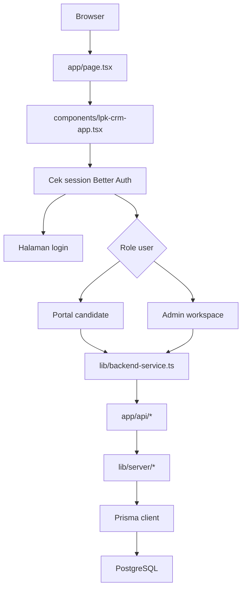
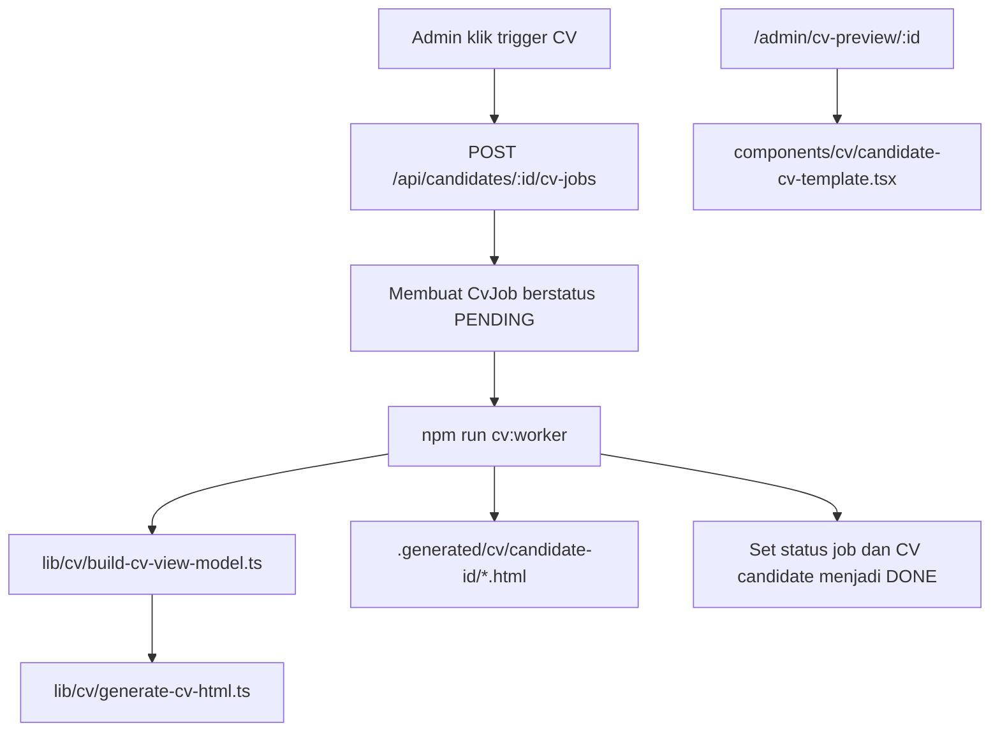

# Penjelasan Codebase - 10 Mei

Tag: `10 Mei`

Dokumen ini menjelaskan kondisi terbaru codebase lokal untuk LPK Candidate CRM. Tujuannya adalah memberi peta praktis untuk developer yang perlu memahami titik masuk aplikasi, alur data, dan file mana yang perlu diperhatikan saat melakukan perubahan.

## 1. Gambaran Besar Saat Ini

Project ini adalah aplikasi full-stack Next.js. Satu repository berisi:

- UI browser, dibuat dengan React, TypeScript, Tailwind CSS, dan komponen kecil bergaya shadcn.
- Backend API route di dalam `app/api`.
- Login dan session memakai Better Auth.
- Akses database memakai Prisma.
- Model data PostgreSQL untuk candidate, user, file, hasil tes, audit log, dan CV job.
- Alur generate CV lokal yang membuat view model CV, menampilkan preview React, dan bisa menghasilkan HTML melalui worker script.

Alur utama aplikasi sudah tidak bergantung pada mock data. Browser memanggil `lib/backend-service.ts`, file itu memanggil API route asli, lalu API route memakai Prisma untuk membaca dan menulis ke PostgreSQL.

## 2. Alur Runtime Utama

Halaman pertama adalah `app/page.tsx`. File itu hanya merender `LpkCrmApp`. `components/lpk-crm-app.tsx` bertanggung jawab untuk memuat session, login/logout, menentukan role, dan refresh data awal.

Jika user adalah candidate, aplikasi menampilkan `CandidatePortalRebuilt`. Jika user adalah admin atau superadmin, aplikasi menampilkan `AdminWorkspace`.

## 3. Folder Penting

| Path | Fungsi |
|---|---|
| `app/` | Page dan API route Next.js App Router. |
| `app/api/` | Endpoint backend bergaya REST. |
| `app/admin/cv-preview/[id]/page.tsx` | Halaman preview CV server-rendered untuk satu candidate. |
| `components/` | Komponen UI React. |
| `components/admin/` | Dashboard admin, shell, halaman candidate, CV jobs, files, audit logs, dan settings. |
| `components/cv/` | Template React CV yang dipakai halaman preview. |
| `components/ui/` | Komponen reusable seperti button, card, input, tabs, badge, progress, dan textarea. |
| `lib/` | Logic bersama, browser API client, type, dan helper mock/fallback lama. |
| `lib/server/` | Logic server-only untuk auth, Prisma, API helper, dan normalisasi input candidate. |
| `lib/cv/` | Pembuat view model CV dan generator HTML CV. |
| `prisma/` | Schema Prisma, migration, dan seed script. |
| `scripts/` | Script lokal, termasuk CV worker. |

Folder hasil generate atau cache seperti `.next/`, `.generated/`, `node_modules/`, `.npm-cache/`, `.pnpm-store/`, `.tmp/`, dan `tsconfig.tsbuildinfo` bukan source utama.

## 4. Entry Point Frontend

| File | Peran |
|---|---|
| `app/page.tsx` | Root page. Merender komponen CRM utama. |
| `app/layout.tsx` | Shell HTML global dan metadata. |
| `app/globals.css` | Layer Tailwind, variabel theme, dan style global aplikasi. |
| `components/lpk-crm-app.tsx` | Koordinator utama untuk auth, routing berdasarkan role, refresh backend, login, dan logout. |
| `components/candidate-portal-rebuilt.tsx` | Form besar candidate dalam Bahasa Indonesia. Menyimpan ke backend jika `useBackend` aktif. |
| `components/admin/admin-workspace.tsx` | Router workspace admin untuk dashboard, candidates, CV jobs, files, audit logs, dan settings. |
| `components/admin/app-shell.tsx` | Layout admin responsif dengan sidebar, header, navigasi halaman, dan logout. |

## 5. Admin Workspace

Pada kondisi 10 Mei, area admin sudah lebih modular. `AdminWorkspace` menyimpan halaman admin aktif di local state dan merender satu komponen halaman sesuai pilihan:

- `DashboardPage` untuk metrik operasional dan aktivitas terbaru.
- `CandidatesPage` untuk filter, sort, memilih candidate, dan membuat candidate baru.
- `CandidateDetail` untuk edit data candidate, tambah file, tambah hasil tes, trigger CV generation, dan melihat log.
- `CvJobsPage` untuk melihat dan retry CV jobs.
- `FilesPage` untuk record file.
- `AuditLogsPage` untuk riwayat audit admin.
- `SettingsPage` untuk tampilan user/role dan placeholder konfigurasi.

UI admin menjalankan aksi melalui `backendService`, lalu memanggil `onRefresh()` untuk mengambil ulang data kanonis dari API.

## 6. Backend API Route

| Route | Perilaku utama |
|---|---|
| `app/api/auth/[...all]/route.ts` | Endpoint Better Auth untuk session, login, dan logout. |
| `app/api/candidates/route.ts` | List candidate dan membuat candidate. Admin bisa melihat semua; candidate hanya melihat record miliknya. |
| `app/api/candidates/[id]/route.ts` | Membaca, update, atau soft-delete satu candidate. Update candidate akan membuat status CV menjadi `STALE` kecuali request memang mengirim `cvStatus`. |
| `app/api/candidates/[id]/files/route.ts` | List dan membuat record file candidate. |
| `app/api/files/[id]/route.ts` | Update atau soft-delete satu record file. |
| `app/api/candidates/[id]/test-results/route.ts` | List dan membuat record hasil tes candidate. |
| `app/api/candidates/[id]/cv-jobs/route.ts` | List CV jobs dan membuat job baru berstatus `PENDING` untuk satu atau beberapa bahasa. |
| `app/api/cv-jobs/[id]/route.ts` | Update atau soft-delete satu CV job. |
| `app/api/audit-logs/route.ts` | List audit log khusus admin, dengan filter entity opsional. |

Logic server bersama ada di `lib/server/api.ts`. File itu menyediakan enforcement session, cek role, parsing JSON, pengambilan IP, dan konversi JSON untuk audit.

## 7. Model Data

Schema database didefinisikan di `prisma/schema.prisma`. Model intinya adalah:

- `User`, `Session`, `Account`, dan `Verification` untuk Better Auth.
- `Candidate` untuk profil lengkap candidate.
- `TestResult` untuk percobaan skor candidate.
- `CvJob` untuk job generate CV.
- `CandidateFile` untuk record file upload atau hasil generate.
- `AuditLog` untuk perubahan data oleh admin/candidate.

Enum penting:

- `UserRole`: `CANDIDATE`, `ADMIN`, `SUPERADMIN`
- `ProfileStatus`: `DRAFT`, `INCOMPLETE`, `COMPLETE`, `ARCHIVED`
- `CvStatus`: `PENDING`, `PROCESSING`, `DONE`, `FAILED`, `STALE`
- `FileType`: `PHOTO`, `DOCUMENT`, `VIDEO`, `CV`
- `CvLanguage`: `ID`, `JA`

`lib/server/candidate-data.ts` adalah batas utama antara JSON request dan data Prisma. File ini menentukan field candidate yang boleh ditulis dan menormalisasi tanggal, integer, boolean, array, gender, profile status, CV status, file type, dan CV language.

## 8. Mapping Browser ke Backend

`lib/backend-service.ts` adalah browser API client. File ini:

- Memanggil endpoint Better Auth dengan cookie.
- Memanggil endpoint REST di bawah `/api`.
- Mengubah record database menjadi record yang lebih mudah dipakai UI.
- Menormalisasi enum dari gaya Prisma huruf besar menjadi gaya UI huruf kecil.
- Membuat `additionalFields` agar form candidate tetap bisa membawa field database yang lebih lengkap tanpa harus mengubah type `Candidate` sederhana di UI.

File ini penting karena sebagian besar komponen frontend memakai type sederhana dari `lib/types.ts`, sementara database memiliki field yang jauh lebih banyak.

## 9. Alur Generate CV

Generate CV sekarang terdiri dari tiga bagian:

API membuat row job. Script lokal `scripts/cv-worker.ts` memproses job pending paling lama, membangun data CV, menulis HTML ke `.generated/cv/...`, mengupdate job dengan preview URL dan storage key, lalu menandai status CV candidate sebagai `DONE`.

Route preview di `app/admin/cv-preview/[id]/page.tsx` mengambil candidate dan hasil tes terbaru langsung dari Prisma, membangun view model yang sama, lalu merender `CandidateCvTemplate`.

Batasan saat ini: alur ini masih berupa HTML/preview lokal, belum upload ke cloud storage dan belum menjadi pipeline export PDF final.

## 10. Auth dan Role

Better Auth dikonfigurasi di `lib/server/auth.ts` dengan Prisma adapter. Enforcement session dilakukan melalui `requireSession()`.

Perilaku role:

- `CANDIDATE`: hanya bisa mengakses data candidate miliknya sendiri.
- `ADMIN`: bisa mengelola candidate, file, test, CV job, dan operasi yang terlihat di audit.
- `SUPERADMIN`: saat ini mendapat kemampuan admin ditambah affordance UI khusus superadmin jika sudah diimplementasikan.

User seed lokal didokumentasikan di codebase map lama. Cek `prisma/seed.cjs` jika credential atau data seed berubah.

## 11. Mana yang Sudah Real vs Masih Lokal/Mock

Sudah real di app lokal saat ini:

- Login/session Better Auth.
- Read/write PostgreSQL melalui Prisma.
- CRUD candidate dengan soft delete.
- Create/list test result.
- Create/list/update/soft-delete record file.
- Create/update/soft-delete CV job.
- Audit log untuk mutasi penting.
- Halaman dashboard admin dan detail candidate.
- Generate HTML CV lokal dan preview CV server-rendered.

Masih lokal-only atau belum lengkap:

- Record file belum mengupload binary file ke object storage sungguhan.
- Output CV masih HTML/preview, belum pipeline PDF final.
- Field terjemahan Jepang di view model CV sebagian besar masih placeholder.
- File fallback lama masih ada: `lib/store.ts`, `lib/mock-service.ts`, dan `lib/mock-data.ts`.

## 12. Command Umum

| Command | Fungsi |
|---|---|
| `npm run dev` | Menjalankan development server Next.js. |
| `npm run build` | Build aplikasi. |
| `npm run lint` | Menjalankan ESLint. |
| `npm run typecheck` | Menjalankan pengecekan TypeScript. |
| `npm run db:generate` | Generate Prisma Client. |
| `npm run db:migrate` | Menjalankan migration Prisma untuk development. |
| `npm run db:seed` | Mengisi data seed lokal. |
| `npm run cv:worker` | Memproses satu CV job pending menjadi HTML lokal. |

## 13. Panduan Edit Aman

Biasanya aman diedit:

- Komponen halaman admin di `components/admin/`.
- UI form candidate di `components/candidate-portal-rebuilt.tsx`.
- Mapping browser di `lib/backend-service.ts`, jika bentuk API/database berubah.
- API route di `app/api/`, jika perubahan perilakunya memang disengaja.
- File CV view/model di `lib/cv/` dan `components/cv/`.

Perlu hati-hati:

- `prisma/schema.prisma`, karena perubahan schema butuh migration dan update seed.
- `lib/server/auth.ts`, karena error auth bisa membuat user tidak bisa login.
- `lib/server/candidate-data.ts`, karena normalisasi field memengaruhi semua create/update candidate.
- `lib/types.ts`, karena banyak komponen bergantung pada shape type ini.

Hindari mengedit output generate/cache:

- `.next/`
- `.generated/` kecuali untuk inspeksi output CV
- `node_modules/`
- `.npm-cache/`
- `.pnpm-store/`
- `tsconfig.tsbuildinfo`

## 14. Mental Model

Pikirkan aplikasi ini sebagai lima layer:

1. Komponen UI menampilkan screen dan menangkap aksi user.
2. `backendService` mengubah aksi itu menjadi HTTP request dan memetakan response backend menjadi type UI.
3. API route mengecek session, permission, validasi, dan audit logging.
4. Prisma membaca dan menulis record PostgreSQL.
5. Logic CV mengubah record candidate menjadi output CV yang bisa dipreview atau dicetak.

Saat mengubah behavior, telusuri jalurnya melalui semua layer tersebut. Contohnya, field candidate baru biasanya perlu update di Prisma schema, seed/default data, `candidate-data.ts`, `backend-service.ts`, shared type atau `additionalFields`, dan komponen form/detail yang relevan.
