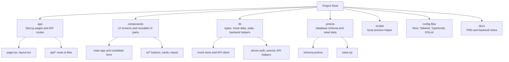
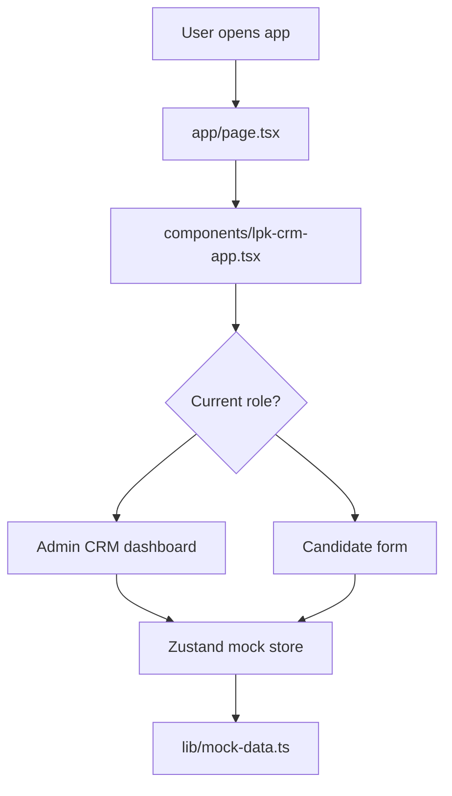
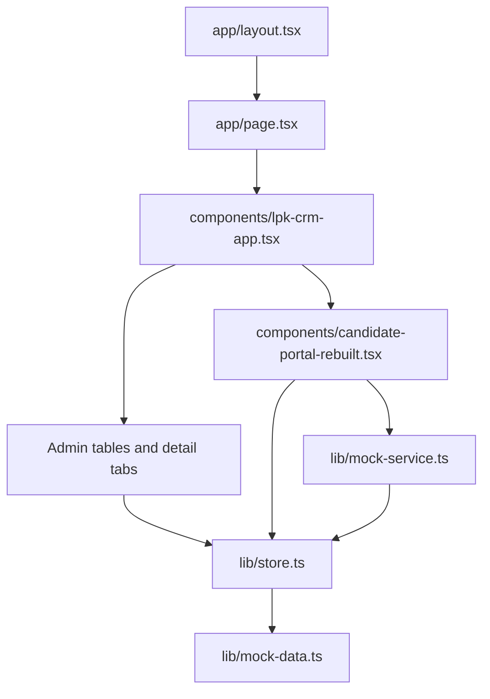
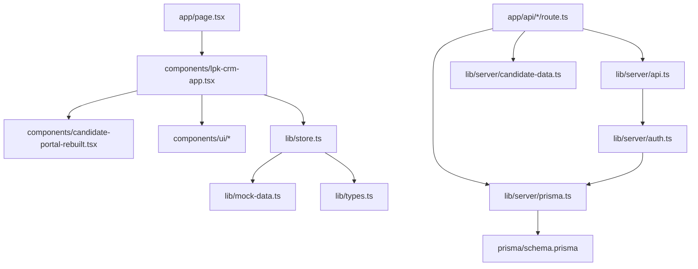
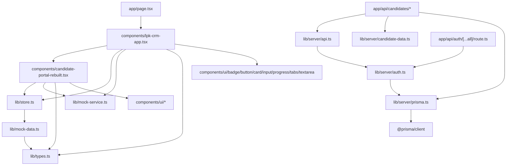
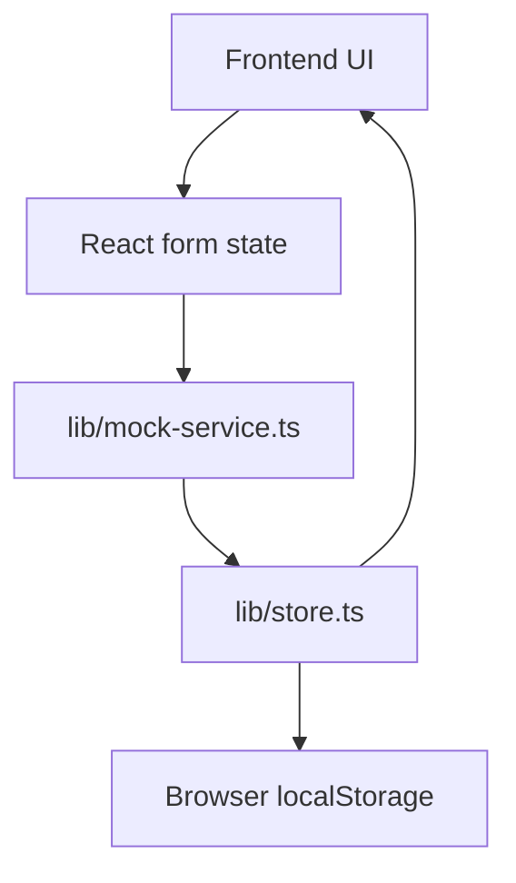
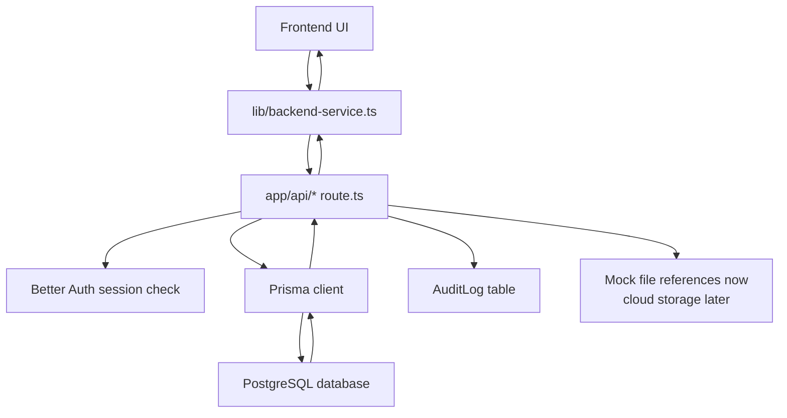

# Codebase Map for Beginners

## 1. Big Picture Summary

- This is a **Next.js full-stack TypeScript app** for an LPK candidate CRM.
- The **frontend UI now talks to the backend REST API through `lib/backend-service.ts`**.
- The **backend foundation exists**: API routes, Prisma schema, Better Auth setup.
- The local database still needs PostgreSQL running before the real backend can be verified end to end.
- Some mock/Zustand files remain as fallback/development data while the local database is being set up.
- Real database tables are defined in `prisma/schema.prisma`.
- Backend API routes live inside `app/api/...`.
- Styling uses Tailwind CSS and small shadcn-style UI components.
- The app starts at `app/page.tsx`, then renders `components/lpk-crm-app.tsx`.

## 2. Folder Structure Diagram

Explanation:

- `app` is where Next.js looks for pages and API endpoints.
- `components` is where visual building blocks live.
- `lib` is shared helper code. Some files are frontend helpers, some are backend helpers.
- `prisma` describes the database.
- Config files tell tools how to build, style, and check the project.

## 3. Important Files Explained

Project root: `C:\Users\fajar\Documents\New project`

### UI

| File / Folder | Purpose | Beginner explanation | Safe to edit? |
|---|---|---|---|
| `app/page.tsx` | Main page | The first page shown at `/`. It renders `LpkCrmApp`. | Usually yes |
| `app/layout.tsx` | App wrapper | Wraps every page with HTML layout and global styles. | Be careful |
| `components/lpk-crm-app.tsx` | Main CRM app | Controls Better Auth login/logout, loads backend candidate data, admin dashboard, candidate detail, and chooses candidate page. | Yes, but important |
| `components/candidate-portal-rebuilt.tsx` | Candidate form UI | The large rebuilt candidate accordion form. It saves to the backend when used by the main app. | Yes |
| `components/ui/button.tsx` | Button component | Reusable button styling. | Usually yes |
| `components/ui/card.tsx` | Card component | Reusable bordered content boxes. | Usually yes |
| `components/ui/input.tsx` | Input component | Reusable text/date/number input. | Usually yes |
| `components/ui/textarea.tsx` | Textarea component | Reusable multi-line input. | Usually yes |
| `components/ui/tabs.tsx` | Tabs component | Reusable tab UI for admin candidate detail. | Usually yes |
| `components/ui/badge.tsx` | Badge component | Small status labels like “Selesai”. | Usually yes |
| `components/ui/progress.tsx` | Progress bar | Shows completion percentage. | Usually yes |

### Logic

| File / Folder | Purpose | Beginner explanation | Safe to edit? |
|---|---|---|---|
| `lib/types.ts` | Shared TypeScript types | Describes the shape of candidates, users, files, CV jobs. Like labels on boxes. | Yes, carefully |
| `lib/store.ts` | Frontend state | Zustand store holding mock users, candidates, files, CV jobs. Kept mostly as fallback/dev data. | Be careful |
| `lib/mock-service.ts` | Fake async service | Pretends to save/update data without a real backend. Kept for fallback/dev mode. | Yes |
| `lib/backend-service.ts` | Backend API client | The browser-side wrapper for Better Auth and candidate REST API calls. It also maps Prisma data into UI-friendly data. | Yes |
| `lib/utils.ts` | CSS helper | Combines Tailwind class names safely. | Rarely needed |

### Data

| File / Folder | Purpose | Beginner explanation | Safe to edit? |
|---|---|---|---|
| `lib/mock-data.ts` | Mock sample data | Fake candidates/users/test results used by current UI. | Yes |
| `prisma/seed.cjs` | Database seed | Inserts starter users/candidates into real DB after setup. | Yes, carefully |
| `prisma/schema.prisma` | Database schema | Blueprint for real PostgreSQL tables. | Be very careful |

### API / Backend

| File / Folder | Purpose | Beginner explanation | Safe to edit? |
|---|---|---|---|
| `app/api/auth/[...all]/route.ts` | Auth endpoint | Better Auth login/session API route. | Be careful |
| `app/api/candidates/route.ts` | Candidate list/create API | Handles `GET /api/candidates` and `POST /api/candidates`. | Yes, carefully |
| `app/api/candidates/[id]/route.ts` | Candidate detail/update/delete API | Handles one candidate by ID. | Yes, carefully |
| `app/api/candidates/[id]/files/route.ts` | Candidate files API | Adds/lists files for a candidate. | Yes |
| `app/api/candidates/[id]/cv-jobs/route.ts` | CV jobs API | Creates/list CV generation jobs. | Yes |
| `app/api/candidates/[id]/test-results/route.ts` | Test result API | Adds/lists test scores. | Yes |
| `app/api/cv-jobs/[id]/route.ts` | CV job update API | Updates or soft-deletes a CV job. | Yes |
| `app/api/files/[id]/route.ts` | File update/delete API | Updates or soft-deletes a file record. | Yes |
| `app/api/audit-logs/route.ts` | Audit log API | Lists audit records for admins. | Yes |
| `lib/server/auth.ts` | Better Auth config | Connects auth to Prisma/Postgres. | Be careful |
| `lib/server/prisma.ts` | Prisma client | Creates the database client used by API routes. | Rarely |
| `lib/server/api.ts` | API helpers | Shared auth checks, JSON parsing, audit helpers. | Yes |
| `lib/server/candidate-data.ts` | Backend input normalizer | Converts API request data into DB-safe Prisma data. | Yes, carefully |

### Config / Styling / Docs

| File / Folder | Purpose | Beginner explanation | Safe to edit? |
|---|---|---|---|
| `package.json` | Scripts and dependencies | Lists commands and libraries. | Be careful |
| `tsconfig.json` | TypeScript config | Tells TypeScript how to check code. | Rarely |
| `next.config.mjs` | Next.js config | Controls build behavior. | Rarely |
| `tailwind.config.ts` | Tailwind config | Styling theme settings. | Yes |
| `app/globals.css` | Global CSS | App-wide colors and Tailwind setup. | Yes |
| `eslint.config.mjs` | Lint config | Code quality rules. | Rarely |
| `components.json` | shadcn config | UI component setup metadata. | Rarely |
| `.env.example` | Env template | Shows needed environment variables. | Yes |
| `.gitignore` | Ignore list | Prevents generated/cache files from being committed. | Yes |
| `BACKEND_UNDONE_TWEAKS.md` | Backend TODOs | Notes backend work left for later. | Yes |
| `LPK_Candidate_CRM_PRD_Final.md` | Product brief | Original requirements document. | Yes |
| `Form field behavior.md` | Form notes | Notes about candidate form behavior. | Yes |
| `scripts/next-preview.cjs` | Preview helper | Starts Next in-process for this sandbox. | Usually no |

Generated/cache files to ignore:

- `node_modules/`
- `.next/`
- `.npm-cache/`
- `.pnpm-store/`
- `.tmp/`
- `package/`
- `npm.tgz`
- `pnpm.cjs`
- `tsconfig.tsbuildinfo`

## 4. App Flow Diagram

Explanation:

- The browser opens the app.
- Next.js loads `app/page.tsx`.
- `page.tsx` renders `LpkCrmApp`.
- `LpkCrmApp` checks the selected role.
- Admin sees the dashboard.
- Candidate sees the rebuilt candidate form.
- Both currently use Zustand mock state, not the real database yet.

Detailed flow:

## 5. Dependency Map

Simplified beginner graph:

Explanation:

- UI files import shared UI components and frontend state.
- API route files import backend helpers and Prisma.
- Prisma connects backend code to the database schema.

Detailed important imports:

## 6. Data Flow Diagram

Current real situation:

Explanation:

- The current UI saves data locally.
- `lib/store.ts` uses Zustand and persists to browser localStorage.
- This means the visible app is still mostly mock/local data.

Backend-ready flow:

Explanation:

- Backend routes exist, but frontend is not fully wired to them yet.
- When integrated, UI will call `lib/backend-service.ts`.
- API routes will check login/session.
- Prisma will read/write PostgreSQL.
- Important changes create audit logs.

## 7. Dependencies Explained

| Dependency | Category | What it does | Where it is used |
|---|---|---|---|
| `next` | Full-stack framework | Runs pages and API routes. | `app/page.tsx`, `app/api/*` |
| `react` | Frontend | Builds UI components. | All `components/*.tsx` |
| `react-dom` | Frontend | Connects React to browser DOM. | Used by Next internally |
| `typescript` | Build/tooling | Adds type checking. | Whole project |
| `tailwindcss` | Styling | Utility CSS classes. | `app/globals.css`, components |
| `postcss` | Styling build | Processes Tailwind CSS. | `postcss.config.mjs` |
| `autoprefixer` | Styling build | Adds browser CSS prefixes. | PostCSS pipeline |
| `lucide-react` | Icons | Provides icons. | `components/lpk-crm-app.tsx`, `candidate-portal-rebuilt.tsx` |
| `react-hook-form` | Forms | Manages form values. | Candidate forms |
| `zod` | Validation | Validates form/API-shaped data. | Older form in `lpk-crm-app.tsx` |
| `@hookform/resolvers` | Forms | Connects Zod to React Hook Form. | `components/lpk-crm-app.tsx` |
| `zustand` | State | Stores current mock app data. | `lib/store.ts` |
| `@prisma/client` | Database | Generated DB client. | `lib/server/prisma.ts`, API helpers |
| `prisma` | Database tooling | Creates migrations, generates client. | `prisma/schema.prisma`, package scripts |
| `better-auth` | Auth backend | Login/session system. | `lib/server/auth.ts`, `app/api/auth/[...all]/route.ts` |
| `@better-auth/prisma-adapter` | Auth/database | Connects Better Auth to Prisma. | `lib/server/auth.ts` |
| `@radix-ui/react-tabs` | UI | Accessible tab component. | `components/ui/tabs.tsx` |
| `@radix-ui/react-slot` | UI | Lets Button render as child element. | `components/ui/button.tsx` |
| `class-variance-authority` | UI utility | Manages style variants. | `button.tsx`, `badge.tsx` |
| `clsx` | Utility | Combines class names. | `lib/utils.ts` |
| `tailwind-merge` | Utility | Fixes conflicting Tailwind classes. | `lib/utils.ts` |
| `eslint` | Tooling | Finds code quality problems. | `npm run lint` |
| `eslint-config-next` | Tooling | Next.js lint rules. | `eslint.config.mjs` |

## 8. Beginner Glossary

- **Frontend**: The part users see and click. Here: `components/*`.
- **Backend**: Server code that handles data and security. Here: `app/api/*`, `lib/server/*`.
- **Component**: A reusable piece of UI, like a button or form section.
- **Route**: A URL handled by the app. Example: `/api/candidates`.
- **API**: A way for frontend and backend to talk.
- **Endpoint**: One specific API URL, like `GET /api/candidates`.
- **State**: Data the UI remembers while the app runs. Here: Zustand store.
- **Props**: Data passed into a React component.
- **Hook**: A React function for state/effects/forms. Example: `useState`, `useForm`.
- **Schema**: A blueprint. Prisma schema describes database tables.
- **Database**: Real storage for app data. Planned: PostgreSQL.
- **Migration**: A database change file created from schema changes.
- **Environment variable**: Secret/config value outside code, like `DATABASE_URL`.
- **Build**: Preparing code for production.
- **Deploy**: Putting app online.
- **Dependency**: External package installed from npm.
- **Import**: Code using code from another file.
- **Export**: Code making something available to other files.
- **Mock data**: Fake data used before real backend integration.
- **Soft delete**: Marking data deleted with `deletedAt`, not removing it.

## 9. What I Should Learn First

- **Level 1: Must understand now**
  - Basic React components
  - Props and state
  - How `app/page.tsx` starts the UI
  - How `components/lpk-crm-app.tsx` chooses admin vs candidate screen
  - How `lib/store.ts` stores mock data

- **Level 2: Understand later**
  - React Hook Form
  - Tailwind CSS
  - API routes in `app/api`
  - Prisma schema basics
  - Better Auth sessions

- **Level 3: Advanced / optional**
  - Database migrations
  - Audit logs
  - Worker queues for CV generation
  - File storage with S3/GCS
  - Production deployment and environment secrets

## 10. Questions I Should Ask Before Editing

- Which file controls the screen I want to change?
- Is this screen using mock data or real API data?
- If I edit this, does it affect only the UI or also the database?
- Is this value stored in `lib/store.ts`, `lib/mock-data.ts`, or PostgreSQL?
- Does this field also exist in `prisma/schema.prisma`?
- Does changing this field require changing API normalization in `lib/server/candidate-data.ts`?
- Does this change need an audit log?
- Is this safe for candidates, admins, and superadmins?
- Will this break seeded data in `prisma/seed.cjs`?
- Should the frontend and backend both validate this rule?
- Is this file generated/cache, meaning I should not edit it?
