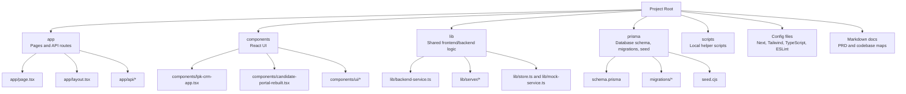
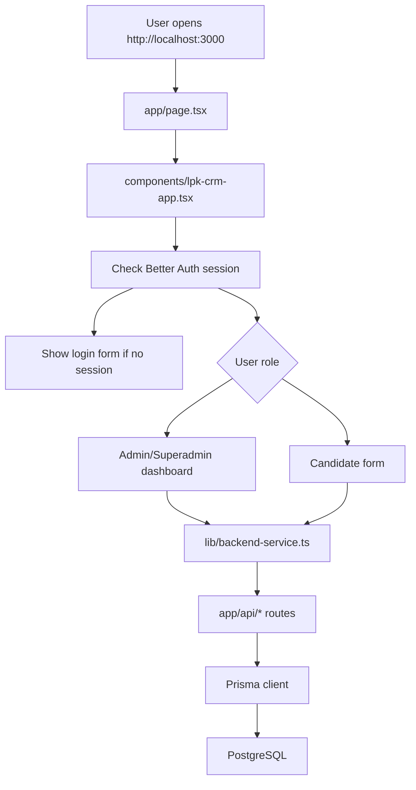
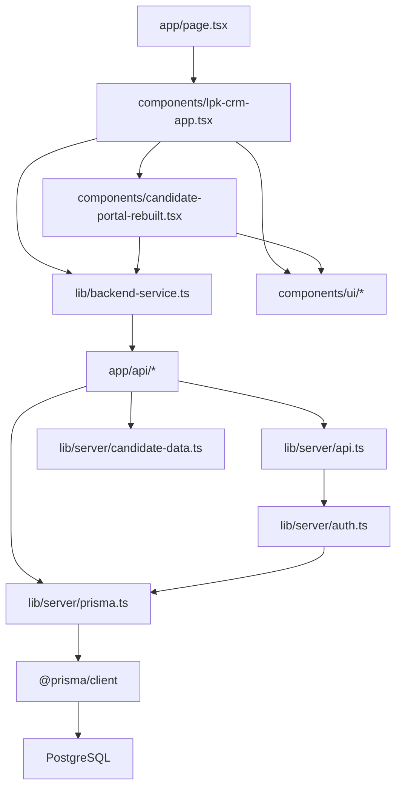
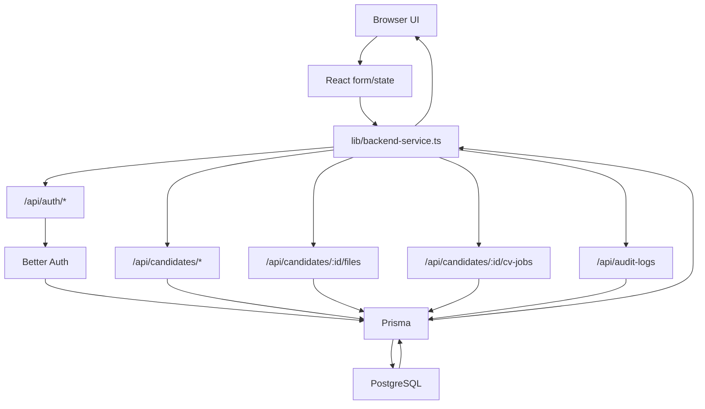

# Codebase Map for Beginners — May 9th Update

This document explains the current verified state of the LPK Candidate CRM after the real local backend integration.

## 1. Big Picture Summary

- This is a **full-stack Next.js app**. That means the same project contains the frontend pages and backend API routes.
- The app uses **Next.js App Router**, so pages and API endpoints live under the `app` folder.
- The frontend is built with **React**, **TypeScript**, **Tailwind CSS**, and small **shadcn-style UI components**.
- Login/logout uses **Better Auth**.
- The database layer uses **Prisma**.
- The real local database is **PostgreSQL**.
- The main frontend now reads and writes real backend data through `lib/backend-service.ts`.
- Backend API routes live in `app/api/...` and return REST-style JSON.
- Candidate/admin data is now verified locally against PostgreSQL, not only mock data.
- File upload is still mocked: the app creates file records, but it does not upload real files to cloud storage yet.
- CV generation is still job-status-only: the app creates `CvJob` rows, but there is no real CV worker yet.

Verified seeded users:

| Role | Email | Password |
|---|---|---|
| Admin | `admin@lpk.local` | `password123` |
| Superadmin | `superadmin@lpk.local` | `password123` |
| Candidate | `candidate@lpk.local` | `password123` |

## 2. Folder Structure Diagram



Explanation:

- `app` is where Next.js finds pages and backend API routes.
- `components` contains the screens and reusable UI pieces.
- `lib` contains shared logic. Some files run in the browser, and some run only on the server.
- `prisma` contains the database blueprint, migration files, and seed script.
- Config files tell the tools how to build, style, and check the app.

## 3. Important Files Explained

Project root: `C:\Users\fajar\Documents\New project`

### UI

| File / Folder | Purpose | Beginner explanation | Safe to edit? |
|---|---|---|---|
| `app/page.tsx` | Home page | The first page at `/`. It renders the main CRM app. | Usually yes |
| `app/layout.tsx` | App wrapper | Wraps all pages with HTML structure and global CSS. | Be careful |
| `app/globals.css` | Global styles | App-wide Tailwind setup, colors, and base styles. | Yes |
| `components/lpk-crm-app.tsx` | Main CRM shell | Handles Better Auth login/logout, loads real backend data, shows admin dashboard or candidate form. | Yes, carefully |
| `components/candidate-portal-rebuilt.tsx` | Candidate form | Large Bahasa Indonesia accordion form. In the main app, it saves to the real backend. | Yes, carefully |
| `components/ui/*` | Reusable UI components | Buttons, cards, inputs, tabs, badges, progress bars. These are like reusable Lego pieces. | Usually yes |

### Frontend Logic

| File / Folder | Purpose | Beginner explanation | Safe to edit? |
|---|---|---|---|
| `lib/backend-service.ts` | Browser API client | The frontend uses this to call Better Auth and REST API routes. It also maps database-shaped data into UI-shaped data. | Yes, carefully |
| `lib/types.ts` | Shared TypeScript types | Defines common shapes like `Candidate`, `CandidateFile`, `CvJob`, and `AuditLog`. | Yes, carefully |
| `lib/store.ts` | Zustand fallback state | Older/mock state helper. It remains for fallback/dev behavior, but it is not the main source of truth in the verified app flow. | Avoid unless needed |
| `lib/mock-service.ts` | Mock service | Fake async save/update helpers used only by fallback/dev paths. | Avoid unless editing fallback mode |
| `lib/mock-data.ts` | Mock sample data | Old local sample candidates/users/files. Real verified flow uses PostgreSQL instead. | Usually no |
| `lib/utils.ts` | CSS helper | Combines Tailwind class names safely. | Rarely |

### Backend / API

| File / Folder | Purpose | Beginner explanation | Safe to edit? |
|---|---|---|---|
| `app/api/auth/[...all]/route.ts` | Better Auth endpoint | Handles login, logout, and session requests. | Be careful |
| `app/api/candidates/route.ts` | Candidate list/create API | Handles listing and creating candidates. | Yes, carefully |
| `app/api/candidates/[id]/route.ts` | Candidate detail/update/delete API | Handles one candidate by ID. Candidate form saves go here. | Yes, carefully |
| `app/api/candidates/[id]/files/route.ts` | Candidate file API | Lists and creates mock file records. | Yes |
| `app/api/candidates/[id]/cv-jobs/route.ts` | CV job API | Lists and creates CV generation job records. | Yes |
| `app/api/candidates/[id]/test-results/route.ts` | Test result API | Lists and creates candidate test scores. | Yes |
| `app/api/cv-jobs/[id]/route.ts` | CV job update API | Updates or soft-deletes a CV job. | Yes |
| `app/api/files/[id]/route.ts` | File update/delete API | Updates or soft-deletes a file record. | Yes |
| `app/api/audit-logs/route.ts` | Audit API | Admin-only endpoint for reading audit logs. | Yes, carefully |
| `lib/server/auth.ts` | Better Auth config | Connects Better Auth to Prisma/PostgreSQL. | Be careful |
| `lib/server/prisma.ts` | Prisma client | Creates the database client used by backend routes. | Rarely |
| `lib/server/api.ts` | API helpers | Shared session checks, JSON parsing, permission checks, and audit helpers. | Yes, carefully |
| `lib/server/candidate-data.ts` | API input normalizer | Converts request data into Prisma-safe database data. | Yes, carefully |

### Database

| File / Folder | Purpose | Beginner explanation | Safe to edit? |
|---|---|---|---|
| `prisma/schema.prisma` | Database schema | The blueprint for PostgreSQL tables and relationships. | Be very careful |
| `prisma/migrations/*/migration.sql` | Migration history | SQL files Prisma created to build the database. | Usually no |
| `prisma/seed.cjs` | Seed data | Inserts starter candidates and Better Auth users. | Yes, carefully |
| `.env` | Local secrets/config | Holds local `DATABASE_URL`, `BETTER_AUTH_SECRET`, and `BETTER_AUTH_URL`. | Yes, but do not commit |
| `.env.example` | Env template | Safe example of required environment variables. | Yes |

### Config / Docs

| File / Folder | Purpose | Beginner explanation | Safe to edit? |
|---|---|---|---|
| `package.json` | Scripts/dependencies | Lists commands like `dev`, `build`, `lint`, `db:migrate`, and libraries used by the app. | Be careful |
| `tsconfig.json` | TypeScript config | Tells TypeScript how to check code. | Rarely |
| `next.config.mjs` | Next config | Controls Next.js build/runtime options. | Rarely |
| `tailwind.config.ts` | Tailwind config | Controls design tokens and styling behavior. | Yes |
| `eslint.config.mjs` | Lint config | Controls code quality rules. | Rarely |
| `.gitignore` | Ignore file | Prevents generated files and secrets from being committed. | Yes |
| `BACKEND_UNDONE_TWEAKS.md` | Backend TODOs | Notes backend work intentionally left for later. | Yes |
| `LPK_Candidate_CRM_PRD_Final.md` | PRD | Product requirements that guided this app. | Yes |

Generated/cache folders to ignore:

- `node_modules/`
- `.next/`
- `.npm-cache/`
- `.pnpm-store/`
- `.tmp/`
- `package/`
- `tsconfig.tsbuildinfo`

## 4. App Flow Diagram



Explanation:

- The browser opens the app.
- `app/page.tsx` loads the main CRM component.
- The main app asks Better Auth whether the user is logged in.
- If not logged in, the app shows the login form.
- If logged in, the app checks the user role.
- Admin and Superadmin see the dashboard.
- Candidate sees the candidate form.
- Both UI paths use `lib/backend-service.ts` to call real API routes.
- API routes use Prisma to read/write PostgreSQL.

## 5. Dependency Map

Simplified dependency map:



Explanation:

- UI files import reusable UI components and `backend-service`.
- `backend-service` calls API URLs like `/api/candidates`.
- API routes import server helpers and Prisma.
- Prisma talks to PostgreSQL.

Important note:

- `lib/store.ts`, `lib/mock-service.ts`, and `lib/mock-data.ts` still exist.
- They are now fallback/dev helpers, not the main data path for the verified app.

## 6. Data Flow Diagram



Explanation:

- The user edits the UI.
- The UI stores temporary form state in React.
- On save/login/action, the browser calls `lib/backend-service.ts`.
- `backend-service` sends JSON requests to API routes.
- API routes check session/role, then use Prisma.
- Prisma writes to PostgreSQL.
- The updated data returns back to the UI.

Current mock limitations:

- Mock upload means a database row is created for a file, but no real file is uploaded.
- CV generation creates job rows and status changes, but no worker creates real PDF files yet.

## 7. Dependencies Explained

| Dependency | Category | What it does | Where it is used |
|---|---|---|---|
| `next` | Framework | Runs the full-stack app: pages, API routes, build/dev server. | `app/*`, `package.json` scripts |
| `react` | Frontend | Builds interactive UI components. | `components/*` |
| `react-dom` | Frontend | Renders React into the browser. | Next.js runtime |
| `typescript` | Language/tooling | Adds type checking to JavaScript. | Whole project |
| `tailwindcss` | Styling | Utility CSS classes for layout and design. | UI components and `app/globals.css` |
| `postcss` | Styling/build | Processes Tailwind CSS. | `postcss.config.mjs` |
| `autoprefixer` | Styling/build | Adds browser CSS prefixes. | PostCSS pipeline |
| `lucide-react` | Icons | Provides icons used in buttons/cards/tabs. | `components/lpk-crm-app.tsx`, candidate form |
| `class-variance-authority` | UI utility | Helps define button style variants. | `components/ui/button.tsx` |
| `clsx` | UI utility | Combines conditional class names. | `lib/utils.ts` |
| `tailwind-merge` | UI utility | Merges Tailwind classes safely. | `lib/utils.ts` |
| `@radix-ui/react-slot` | UI utility | Used by shadcn-style Button `asChild` behavior. | `components/ui/button.tsx` |
| `@radix-ui/react-tabs` | UI component | Accessible tab behavior. | `components/ui/tabs.tsx` |
| `react-hook-form` | Form state | Handles candidate form inputs. | `components/candidate-portal-rebuilt.tsx` |
| `@hookform/resolvers` | Form validation helper | Connects validation libraries to React Hook Form. | Available for forms |
| `zod` | Validation | Schema validation library. | Available for validation |
| `zustand` | State | Legacy/fallback local state store. | `lib/store.ts` |
| `better-auth` | Auth | Login/session/authentication library. | `lib/server/auth.ts`, `lib/backend-service.ts` |
| `@better-auth/prisma-adapter` | Auth/database | Connects Better Auth to Prisma. | `lib/server/auth.ts` |
| `prisma` | Database tooling | Runs migrations and generates Prisma client. | `prisma/*`, npm scripts |
| `@prisma/client` | Database client | Code used by API routes to query PostgreSQL. | `lib/server/prisma.ts`, API routes |
| `eslint` | Code quality | Checks code for common problems. | `npm run lint` |
| `eslint-config-next` | Code quality | Next.js-specific ESLint rules. | `eslint.config.mjs` |

## 8. Beginner Glossary

- **Frontend**: The part users see in the browser.
- **Backend**: The server-side part that handles data, auth, and database access.
- **Full-stack app**: An app with both frontend and backend in one project.
- **Component**: A reusable piece of UI, like a button, card, dashboard, or form section.
- **Route**: A URL path handled by the app. Example: `/` or `/api/candidates`.
- **API**: A backend interface the frontend calls to request or save data.
- **Endpoint**: One specific API URL, such as `GET /api/candidates`.
- **REST JSON**: A common API style where browser and server exchange JSON data.
- **State**: Data the UI remembers while running, such as form input values.
- **Props**: Data passed from one React component to another.
- **Hook**: A React function for state/effects, such as `useState` or `useEffect`.
- **Schema**: A blueprint. `prisma/schema.prisma` describes database tables.
- **Database**: Real long-term storage. This app uses PostgreSQL.
- **Migration**: A database change file that creates or updates tables.
- **Seed**: Starter data inserted into the database for local development.
- **Authentication**: Login/logout and knowing who the user is.
- **Authorization**: Deciding what a logged-in user is allowed to do.
- **Session**: A saved login state in the browser/server.
- **Prisma**: The tool that lets TypeScript code safely talk to PostgreSQL.
- **Environment variable**: Config stored outside code, usually in `.env`.
- **Build**: The process of preparing the app for production.
- **Dependency**: A library installed from npm and used by the app.
- **Import**: Code using another file or library.
- **Export**: Code making something available to other files.
- **Mock**: Fake behavior used before a real backend/service exists.
- **Soft delete**: Marking data as deleted without physically removing the row.
- **Audit log**: A history record of important changes.

## 9. What I Should Learn First

### Level 1: Must understand now

- How to start the app with `npm run dev`.
- How login works with the seeded users.
- How `app/page.tsx` renders `components/lpk-crm-app.tsx`.
- How the frontend calls `lib/backend-service.ts`.
- How `backend-service` calls `app/api/*` routes.
- How Prisma stores data in PostgreSQL.

### Level 2: Understand later

- React components and props.
- React form state with `react-hook-form`.
- API route patterns in Next.js.
- Better Auth sessions and user roles.
- Prisma schema and migrations.
- Audit log behavior.

### Level 3: Advanced / optional

- Replacing mock uploads with real cloud storage.
- Building a real CV generation worker.
- Adding automated API tests.
- Adding pagination and advanced filtering.
- Deploying PostgreSQL and the Next.js app to production.

## 10. Questions I Should Ask Before Editing

- Which screen am I changing: admin dashboard, candidate form, login, or API?
- Is this UI-only, or does it save to PostgreSQL?
- Which API route receives this data?
- Which Prisma model/table stores this data?
- Does this change need an audit log?
- Does this change affect Candidate, Admin, or Superadmin?
- Is this field still mock-only, like file upload or CV generation?
- Do I need to update `lib/backend-service.ts` mapping?
- Do I need a Prisma migration?
- Could this break seeded login users?
- Should this be editable by candidates, admins, or both?
- After changing it, how will I verify it in the browser and database?

## 11. Current Verified Local State

The real backend flow was verified locally on May 9:

- PostgreSQL is running locally.
- Prisma migration was applied.
- Seed data was inserted.
- Better Auth seeded users can log in.
- Admin and Superadmin dashboards load real candidate data.
- Candidate form saves draft/final data to PostgreSQL.
- Audit logs are created for candidate updates.
- Mock file records and CV job records write to PostgreSQL.

Useful commands:

```powershell
node .\package\bin\npm-cli.js run dev
node .\package\bin\npm-cli.js run typecheck
node .\package\bin\npm-cli.js run lint
node .\package\bin\npm-cli.js run build
node .\package\bin\npm-cli.js run db:migrate
node .\package\bin\npm-cli.js run db:seed
```
