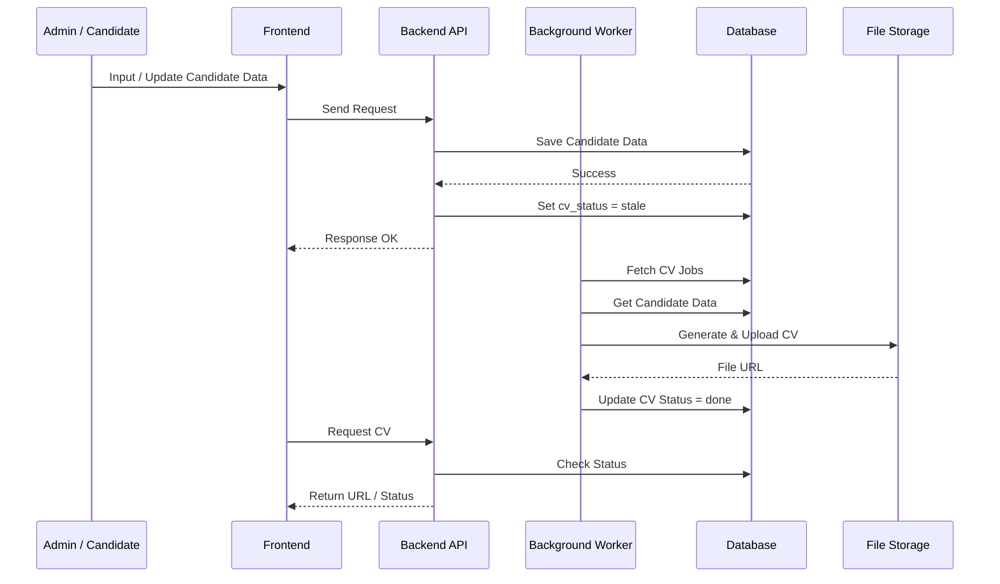
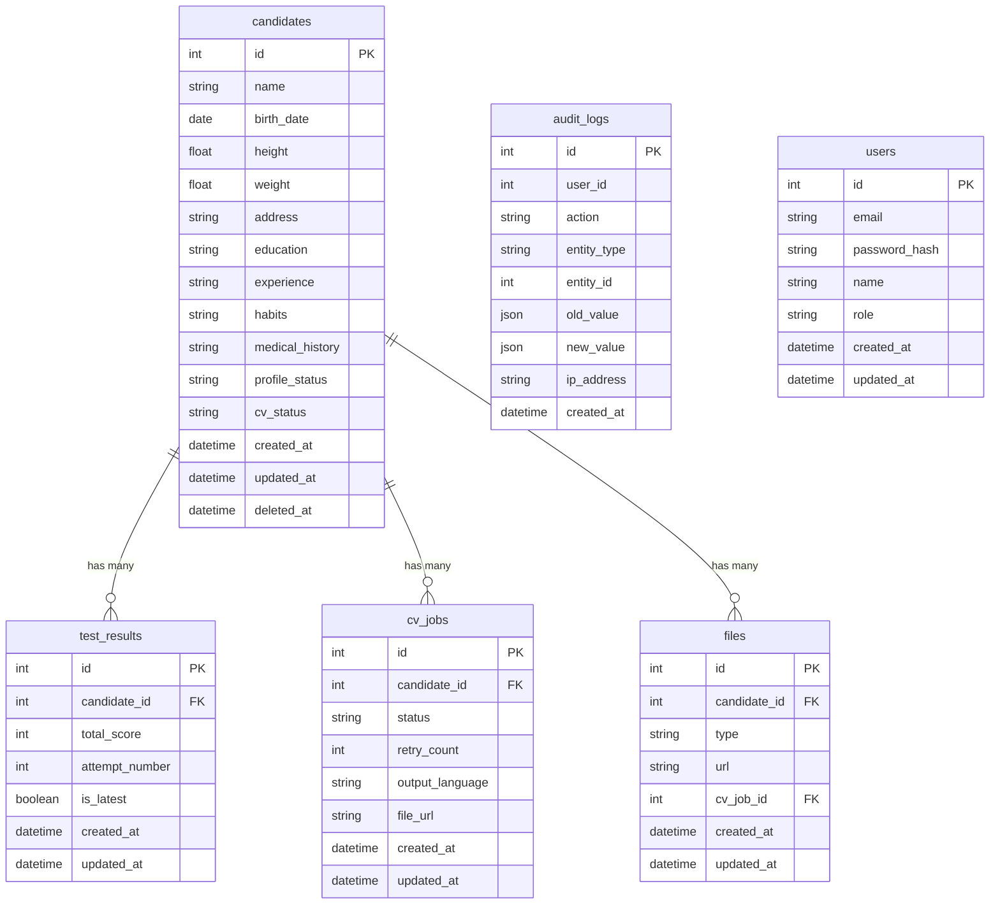

# PRD — LPK Candidate CRM & CV System

## 1. Overview

Sistem ini bertujuan untuk mendigitalisasi proses manajemen kandidat di LPK, yang sebelumnya tersebar di berbagai tools seperti form, spreadsheet, dan chat, menjadi satu sistem terpusat.

Masalah utama yang diselesaikan:
- Data kandidat tidak konsisten dan tersebar
- Proses administrasi manual memakan waktu
- Tidak ada single source of truth untuk kandidat
- Pembuatan CV kandidat masih manual dan tidak scalable
- Sulit melakukan filtering kandidat secara cepat
- Sulit melacak perubahan data dan riwayat output kandidat

Tujuan utama:
- Menyediakan sistem CRM kandidat terpusat
- Menjadikan data kandidat sebagai sumber utama (source of truth)
- Mengotomatisasi generate CV dalam Bahasa Indonesia dan Bahasa Jepang
- Memastikan konsistensi data dan auditability
- Mendukung operasional LPK skala 1,000–10,000 kandidat

---

## 2. Requirements

### 2.1 General Requirements
- **Aksesibilitas:** Web-based, desktop-first
- **User Types:** Candidate, Admin, Superadmin
- **Data Entry:** Manual input berbasis form, progressive, dan draft mode
- **Consistency:** Semua operasi kritikal harus atomic
- **Processing:** Heavy process harus asynchronous
- **State Management:** Semua state harus eksplisit, tidak boleh bergantung pada implicit logic

### 2.2 Data Requirements
- Data kandidat harus lengkap sebelum digunakan secara operasional
- Data kandidat menjadi basis untuk semua output, terutama CV
- Tidak boleh ada implicit overwrite tanpa audit log
- Soft delete berlaku untuk semua entity utama
- Test result harus menyimpan attempt history dan latest flag

### 2.3 System Constraints
- Monolith architecture, bukan microservices
- Tidak ada real-time system; polling atau async OK
- Tidak ada automated ranking system
- Tidak ada ATS / job pipeline
- Tidak ada partner portal atau referral workflow

---

## 3. Core Features

### 3.1 Candidate Management
- Input data kandidat secara bertahap
- Draft mode dan final submission
- Edit dan update data kandidat
- Validasi kelengkapan data
- Kategori data:
  - Identity
  - Physical
  - Address
  - Education
  - Work Experience
  - Family
  - Habits
  - Skills & Test Results
  - Medical History

### 3.2 Test System
- Kandidat dapat melakukan tes berkali-kali
- Menyimpan:
  - `attempt_number`
  - `is_latest`
- Constraint:
  - hanya satu data `is_latest = true` per kandidat
- Candidate harus memiliki minimal satu hasil tes valid untuk proses internal yang membutuhkan skor

### 3.3 CV Generation System
- CV digenerate otomatis dari data kandidat
- Output:
  - CV Bahasa Indonesia
  - CV Bahasa Jepang
- Status:
  - `pending`
  - `processing`
  - `done`
  - `failed`
  - `stale`

Behavior:
- Update data kandidat membuat CV menjadi `stale`
- Generate dilakukan asynchronous melalui background worker
- File hasil generate dapat diakses melalui URL atau storage reference

### 3.4 File Management
- Upload file:
  - Photo
  - Document
  - Video
  - CV
- Semua file terhubung ke candidate
- File CV dapat direferensikan dari hasil generate terbaru

### 3.5 Filtering & Search
- Filter berdasarkan:
  - height
  - weight
  - age
  - test score
  - habits
  - education
  - experience
  - kelengkapan data
  - status CV
- Filter memakai live candidate data, bukan snapshot

### 3.6 Audit Log
- Track:
  - data changes
  - CV generation
  - file upload
  - delete
  - override
- Retention default: 90 hari
- Audit log wajib menyimpan user, aksi, entity, old value, new value, IP, dan timestamp

---

## 4. User Flow

### 4.1 Candidate Flow
1. Candidate input data secara draft
2. Candidate melengkapi seluruh data wajib
3. System melakukan validasi kelengkapan
4. Candidate menyimpan data final
5. System menandai CV sebagai stale atau trigger generate
6. Candidate dapat melihat CV yang sudah tersedia

### 4.2 Admin Flow
1. Admin login
2. Admin melihat dashboard kandidat
3. Admin melakukan search dan filter kandidat
4. Admin edit atau validasi data kandidat
5. Admin trigger CV generation bila diperlukan
6. Admin mengunduh CV kandidat

### 4.3 CV Generation Flow
1. Data kandidat diupdate
2. System set `cv_status = stale`
3. Worker mengambil job generate CV
4. Worker menyusun CV Bahasa Indonesia dan Bahasa Jepang
5. File disimpan ke storage
6. Status diupdate menjadi `done` atau `failed`

---

## 5. Architecture

---

## 6. Database Schema

| Tabel | Deskripsi |
|-------|-----------|
| **candidates** | Master data kandidat, menjadi source of truth untuk seluruh sistem |
| **test_results** | Riwayat hasil tes kandidat dengan penanda latest |
| **cv_jobs** | Job generate CV async beserta status dan retry count |
| **files** | File kandidat, termasuk CV hasil generate |
| **audit_logs** | Catatan perubahan dan aktivitas sistem |
| **users** | Data pengguna sistem dengan role-based access |

---

## 7. Tech Stack

### 7.1 Frontend
- Framework: Next.js (React)
- Styling: Tailwind CSS
- State Management: React Query / Zustand
- Form Handling: React Hook Form

### 7.2 Backend
- Language: TypeScript
- Framework: Node.js (NestJS / Express)
- API: REST berbasis JSON
- Validation: Zod / class-validator

### 7.3 Database
- Primary DB: PostgreSQL
- ORM: Prisma
- Indexing: B-tree default dan composite index untuk filtering

### 7.4 Background Processing
- Worker: Node.js Worker atau BullMQ
- Queue: Redis
- Use Case:
  - CV generation
  - retry mechanism
  - async jobs

### 7.5 File Storage
- Cloud Storage: AWS S3 / Google Cloud Storage
- Optional: Google Drive integration untuk manual sync
- File Access: Signed URL

### 7.6 Authentication & Security
- Auth: JWT-based authentication
- Password hashing: bcrypt
- Role-based access control (RBAC)

### 7.7 Deployment
- Hosting: Vercel untuk frontend, VPS / Railway / Fly.io untuk backend
- Containerization: Docker optional
- CI/CD: GitHub Actions

---

## 8. Design & Technical Constraints

### 8.1 System Principles
1. Semua operasi penting harus atomic
2. Semua proses berat harus async
3. Semua state harus eksplisit
4. Tidak ada implicit logic
5. Data kandidat adalah single source of truth

### 8.2 Performance
- Index yang disarankan:
  - `candidates(height, weight, birth_date)`
  - `test_results(total_score)`
  - `cv_jobs(status)`
- Target skala: 1,000–10,000 kandidat

### 8.3 File Storage Structure
- `/candidate/{candidate_id}/cv/`
- `/candidate/{candidate_id}/documents/`

### 8.4 Data Integrity
- Hanya satu `test_result` dengan `is_latest = true`
- CV harus sinkron dengan data kandidat
- Tidak ada duplicate candidate tanpa kontrol
- Semua perubahan penting tercatat di audit log

---

## 9. Non-Goals

- ATS system
- Job management
- Interview pipeline
- Candidate application system
- Partner/referral system
- Real-time notification
- Microservices architecture

---

## 10. Summary

Produk ini adalah **LPK Candidate CRM & CV System**: sistem internal untuk mendata kandidat, menjaga konsistensi data, menyimpan riwayat perubahan, serta mengenerate CV dalam Bahasa Indonesia dan Bahasa Jepang secara otomatis. Sistem ini dibangun sebagai monolith web app yang fokus pada efisiensi operasional, auditability, dan scalability untuk kebutuhan LPK.
